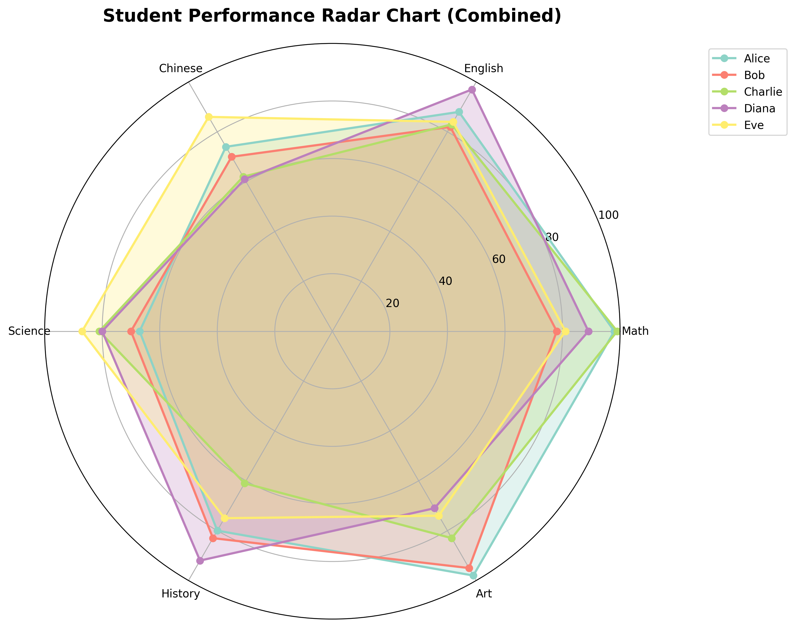

# Radar Chart Generator

A Python application for generating beautiful radar charts from CSV data. Now supports both **individual charts for each student** and **combined charts** with all students together.



## Features

- 📊 Generate **individual radar charts** for each student (separate PNG files)
- 🎯 Generate **combined radar charts** with all students overlaid
- 🎨 Different colors for each student in combined charts
- 📐 Subjects as angles around the chart
- 💾 Save charts as PNG files with automatic naming
- 📈 Data summary and statistics
- 🔧 Customizable chart appearance
- 📁 Organized output with separate directories

## Installation

1. **Clone or download this project**
2. **Install dependencies:**
   ```bash
   pip install -r requirements.txt
   ```

## Usage

### Basic Usage - Generate All Charts
Run the script to generate individual charts for each student plus a combined chart:
```bash
python radar_chart_generator.py
```

This will create:
- Individual charts in `charts/` directory (e.g., `Alice_radar_chart.png`)
- Combined chart as `radar_chart_combined.png`

### Using Your Own CSV File
```bash
python radar_chart_generator.py your_data.csv
```

### Advanced Usage - Python API

```python
from radar_chart_generator import RadarChartGenerator

# Create generator
generator = RadarChartGenerator('your_data.csv')

# Generate all individual charts
generator.generate_all_individual_charts(output_dir="student_charts")

# Generate chart for specific student
generator.generate_individual_chart(
    student_name="Alice",
    save_path="Alice_performance.png"
)

# Generate combined chart
generator.generate_chart(
    title="Class Performance Overview",
    save_path="class_overview.png"
)
```

## Chart Types

### 1. Individual Student Charts
- **One chart per student** showing only their performance
- Clean, focused view of individual performance
- Saved in `charts/` directory by default
- Filename format: `{StudentName}_radar_chart.png`

### 2. Combined Class Chart
- **All students on one chart** for comparison
- Different colors for each student
- Includes legend to identify students
- Saved as `radar_chart_combined.png` by default

## CSV Data Format

Your CSV file should be structured as follows:
- **First column**: Student names (will be used in filenames)
- **Remaining columns**: Subject scores (0-100 recommended)
- **Header row**: Subject names

Example CSV format:
```csv
Student,Math,English,Chinese,Science,History,Art
Alice,85,78,92,88,76,91
Bob,79,85,73,82,89,77
Charlie,92,81,88,95,84,86
Diana,88,90,85,79,92,83
```

## Output Structure

After running the script, you'll have:
```
your_project/
├── charts/                          # Individual student charts
│   ├── Alice_radar_chart.png
│   ├── Bob_radar_chart.png
│   ├── Charlie_radar_chart.png
│   └── Diana_radar_chart.png
├── radar_chart_combined.png          # Combined chart
└── your_data.csv                     # Your input data
```

## Code Structure

### RadarChartGenerator Class

```python
class RadarChartGenerator:
    def __init__(self, csv_file=None)                    # Load data
    def generate_individual_chart(student_name, ...)     # Single student chart
    def generate_all_individual_charts(output_dir, ...)  # All individual charts
    def generate_chart(...)                              # Combined chart
    def print_data_summary(self)                         # Data statistics
```

### Key Methods

- **`generate_all_individual_charts()`**: Creates separate charts for each student
- **`generate_individual_chart()`**: Creates chart for one specific student  
- **`generate_chart()`**: Creates combined chart with all students

## Examples

See `demo_individual_charts.py` for usage examples:
```bash
python demo_individual_charts.py
```

## Customization

You can customize charts by modifying:
- **Colors**: Individual charts use blue theme, combined charts use color palette
- **Chart size**: Change `figsize` parameter (default: 8x8 for individual, 10x8 for combined)
- **Output directory**: Specify custom directory for individual charts
- **Score range**: Modify `ax.set_ylim()` for different scales
- **Grid lines**: Adjust `ax.set_yticks()` values

## File Management

The `.gitignore` is configured to:
- ✅ **Track**: `radar_chart_combined.png` (sample combined output)
- ❌ **Ignore**: `charts/` directory (individual charts)
- ❌ **Ignore**: Other generated PNG files

This keeps your repository clean while preserving important sample outputs.

## Dependencies

- **matplotlib**: For creating the radar charts
- **pandas**: For CSV data handling  
- **numpy**: For numerical operations

## Sample Data

The included sample data contains performance scores for 5 students across 6 subjects:
- Math, English, Chinese, Science, History, Art
- Scores range from 61 to 99

## Troubleshooting

- **File not found**: Ensure your CSV file path is correct
- **Import errors**: Install requirements with `pip install -r requirements.txt`
- **Chart not displaying**: Charts are saved by default, set `show=True` to display
- **Invalid student names**: Special characters in names are cleaned for filenames

## License

This project is open source and available under the MIT License.
