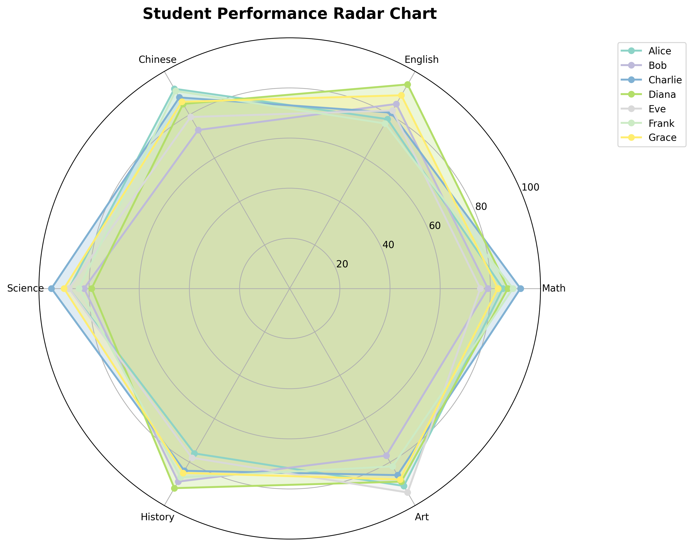

# Radar Chart Generator

A Python application for generating beautiful radar charts from CSV data, where each student is represented by a different colored line and each subject forms an angle on the radar chart.



## Features

- 📊 Generate radar charts from CSV data
- 🎨 Different colors for each student
- 📐 Subjects as angles around the chart
- 💾 Save charts as PNG files
- 📈 Data summary and statistics
- 🔧 Customizable chart appearance

## Installation

1. **Clone or download this project**
2. **Install dependencies:**
   ```bash
   pip install -r requirements.txt
   ```

## Usage

### Using Sample Data
Run the script without arguments to use built-in sample data:
```bash
python radar_chart_generator.py
```

### Using Your Own CSV File
```bash
python radar_chart_generator.py your_data.csv
```

### CSV Data Format

Your CSV file should be structured as follows:
- **First column**: Student names
- **Remaining columns**: Subject scores (0-100 recommended)
- **Header row**: Subject names

Example CSV format:
```csv
Student,Math,English,Chinese,Science,History,Art
Alice,85,78,92,88,76,91
Bob,79,85,73,82,89,77
Charlie,92,81,88,95,84,86
```

## Example Output

The script will:
1. Load and display data summary
2. Generate a radar chart with:
   - Each student as a different colored line
   - Subjects positioned around the radar
   - Semi-transparent filled areas
   - Legend showing student names
3. Save the chart as `radar_chart.png`
4. Display the interactive chart

## Code Structure

### RadarChartGenerator Class

```python
class RadarChartGenerator:
    def __init__(self, csv_file=None)          # Load data from CSV or use sample
    def generate_chart(...)                    # Create and display radar chart
    def print_data_summary(self)               # Show data statistics
```

### Key Parameters

- **title**: Chart title
- **save_path**: Where to save the PNG file
- **show**: Whether to display the chart
- **figsize**: Chart dimensions (width, height)

## Customization

You can customize the chart by modifying:
- Colors: Edit the `colors` variable in `generate_chart()`
- Chart size: Change the `figsize` parameter
- Score range: Modify `ax.set_ylim()` for different scales
- Grid lines: Adjust `ax.set_yticks()` values

## Dependencies

- **matplotlib**: For creating the radar charts
- **pandas**: For CSV data handling
- **numpy**: For numerical operations

## Sample Data

The included `sample_data.csv` contains performance scores for 7 students across 6 subjects:
- Math, English, Chinese, Science, History, Art
- Scores range from 73 to 95

## Troubleshooting

- **File not found**: Ensure your CSV file path is correct
- **Import errors**: Install requirements with `pip install -r requirements.txt`
- **Chart not displaying**: Make sure you have a GUI backend for matplotlib

## License

This project is open source and available under the MIT License.
